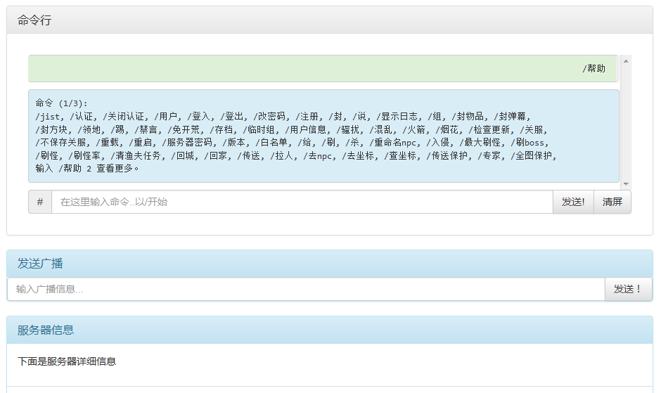

# TShockWebBlao

 TShock Web Manager.
 泰拉游戏服务器TShock的网页控制台 - TShockWebBlao.

 Demo here : 
 示例:
 
 http://tr.blambin.org:8080/TshockWebBlao
 
 http://home.5dsy.info:233/TshockWebBlao
 
###### Current feature 目前版本功能

*  Command line / 纯粹的命令行,支持中文命令输入
*  Basic information of server / 服务器的基本信息
*  Online player inventory view / 查看在线玩家的背包  图形方式显示
*  User management / 管理用户
*  Group management / 管理组
*  Ban management / 被ban玩家管理
*  Log view / 日志查询
*  About / 关于页面
*  Chat / 聊天

ToDo List:

*  Chinese server list / 中文的服务器列表
*  Edit config file / 修改配置文件

###### Preview Command line 预览在线命令行
  
  
  
   
###### 简单搭建教程

*  前提依赖: 安装 
>> java jre 或者  java jdk,tomcat
*  确保依赖安装正常,使用 eclipse 等 ide 打包 war 格式 档.
*  导入项目根目录下的 TshockWebBlao.sql 到数据库里.
*  在 resources/application-dao.xml 里配置数据库服务器的地址,用户和密码信息
*  在 resources/configinfo.properties 里配置用户密码的加密秘钥 
*  就可以启动服务器了. done.

###### Deploy guide 
*  Dependency : Java jre or Java JDK, Tomcat
*  Make sure the dependencies are installed currectly, and pack into .war file via IDE like Eclipse.
*  Import TShockWebBlao.sql into database.
*  Setup the username and password of database in file resources/application-dao.xml.
*  Setup the encrypt key for password in file resources/configinfo.properties.
*  Then start server. Done.

本程式发布在 通用性公开许可证(General Public License，简称GPL)下.你可以有运行、复制软件的自由，发行传播软件的自由，获得软件源码的自由，改进软件并将自己作出的改进版本向社会发行传播的自由。 

Copyleft  
<a class="active" href="http://blambin.org">作者 :blambin</a>&nbsp;&nbsp; 
<a class="active" href="https://www.tshockcn.com/">提供文本:欲情</a>&nbsp;&nbsp; 
<a class="active" href="https://github.com/gyrodrill/">英文翻译:恋</a>

This program is free software: you can redistribute it and/or modify 
it under the terms of the GNU General Public License as published by 
the Free Software Foundation, either version 3 of the License, or 
(at your option) any later version.  
You should have received a copy of the GNU General Public License 
along with this program.  If not, see <http://www.gnu.org/licenses/>. 
